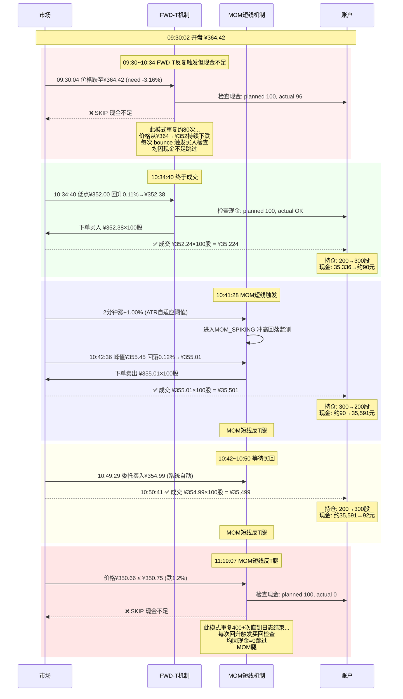
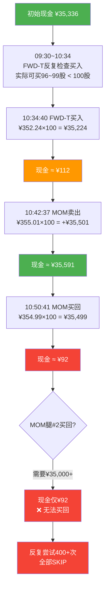
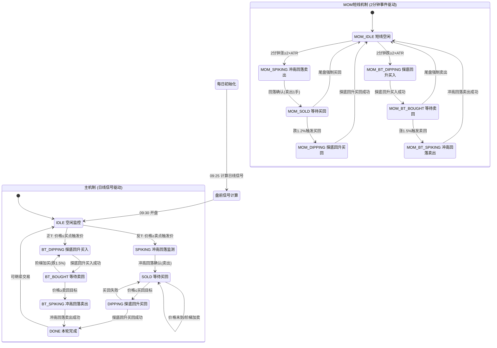
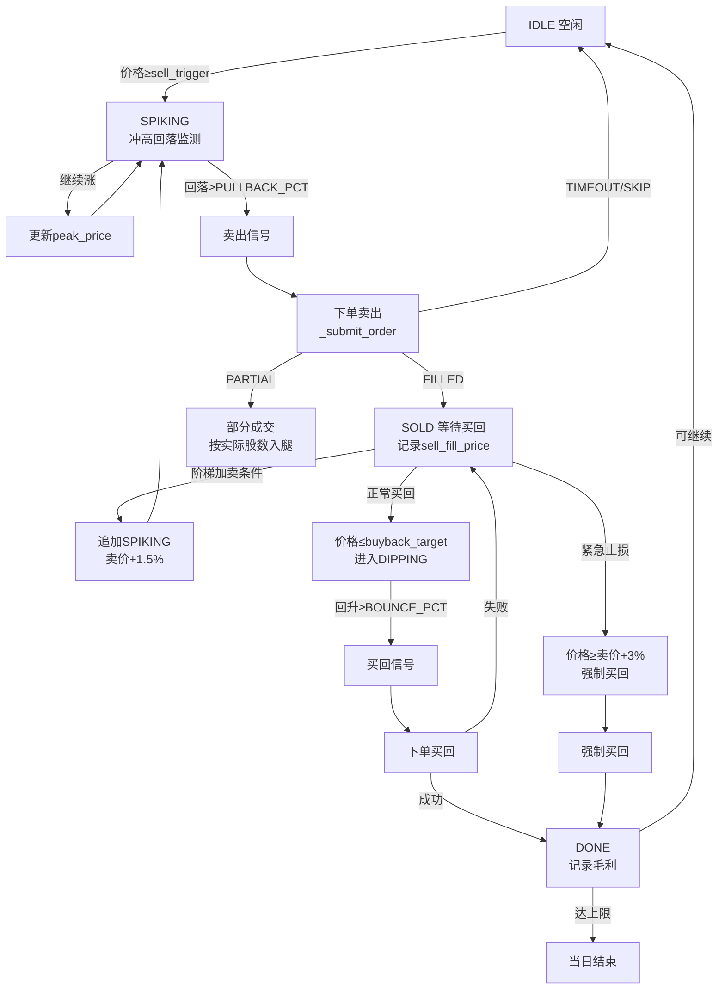
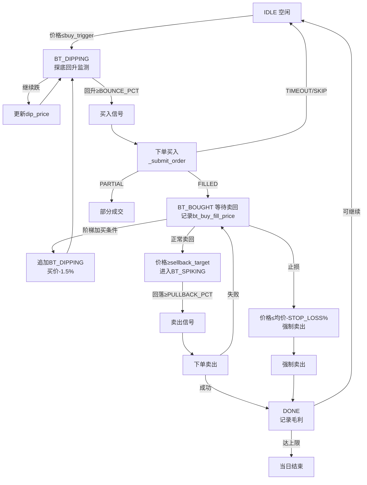
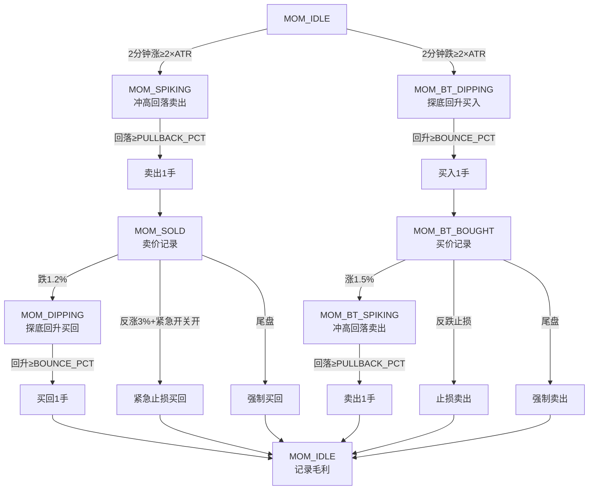

# DayTrading v28 成交分析报告

> 标的: 长飞光纤 601869.SH | 日期: 2026-08-19 | 策略版本: v28

---

## 一、成交记录汇总

当日共发生 **4 笔成交**，均来自短线动量反转机制 (MOM) 和正T机制 (FWD-T)：

| # | 时间 | 方向 | 机制 | 价格 | 数量 | 金额 | 持仓变化 | 现金变化 |
|---|------|------|------|------|------|------|----------|----------|
| 1 | 10:34:40 | **买入** | FWD-T buy | ¥352.24 | 100股 | ¥35,224 | 200→300 | -35,224 |
| 2 | 10:42:37 | **卖出** | MOM short | ¥355.01 | 100股 | ¥35,501 | 300→200 | +35,501 |
| 3 | 10:50:41 | **买入** | MOM buyback | ¥354.99 | 100股 | ¥35,499 | 200→300 | -35,499 |
| 4 | - | **未成交** | MOM buyback | - | 100股 | - | 300→300 | 0 (现金不足) |

### 交易盈亏

| 腿 | 卖出价 | 买回价 | 股数 | 毛利 |
|----|--------|--------|------|------|
| MOM 短线反T | ¥355.01 | ¥354.99 | 100 | **+¥2** (几乎持平) |
| MOM 短线反T(第2腿) | ¥355.01 | 未买回 | 100 | **未平仓** ❌ |
| FWD-T 正T | ¥352.24 买入 | 未卖出 | 100 | **未平仓** (持仓过夜) |

---

## 二、成交流程图



---

## 三、现金不足根因分析



### 核心问题

**MOM短线机制的两笔交易在时间上交叉**：
1. **MOM腿#2** (FWD-T正T): 10:34:40 买入100股 → 花费¥35,224
2. **MOM腿#1** (反T): 10:42:37 卖出100股 → 收回¥35,501
3. **MOM腿#1买回**: 10:50:41 买回100股 → 花费¥35,499

MOM卖回的¥35,501被立即用于买回腿#1 (¥35,499)，**没有剩余现金**给腿#2的后续操作。当MOM腿#2触发买回时，账户现金已接近0。

---

## 四、量化策略整体流程图

### 4.1 主状态机 + MOM短线机制 双轨并行



### 4.2 信号计算流程

```mermaid
flowchart TD
    A[每日09:25] --> B[获取历史数据<br/>60日K线 OHLCV]
    B --> C[compute_signal<br/>计算日线信号]
    C --> D{趋势判断}

    D -->|strong_bull/weak_bull| E[牛市信号]
    D -->|sideways| F[震荡信号]
    D -->|bear| G[熊市信号]

    E --> H[计算 ATR/RSI/成交量比]
    F --> H
    G --> H

    H --> I[输出: trend, atr_pct, rsi,<br/>vol_ratio, sell_mult]
    I --> J{仓位检查}

    J -->|反T: 可卖≥1手| K[✅ REV-T 启用<br/>sell_trigger = open×sell_mult]
    J -->|反T: 可卖<1手| L[❌ REV-T 禁用]
    J -->|正T: 现金≥1手| M[✅ FWD-T 启用<br/>buy_trigger = max(floor, trail)]
    J -->|正T: 现金<1手| N[❌ FWD-T 禁用]

    K --> O[输出每日简报]
    L --> O
    M --> O
    N --> O
```

### 4.3 反T完整流程 (REV-T)



### 4.4 正T完整流程 (FWD-T)



### 4.5 MOM短线机制流程 (2分钟事件驱动)



---

## 五、当日价格走势 & 关键事件时间线

```
时间        价格     事件
────────────────────────────────────────────────────────────
09:30:02   ¥364.42  🟢 开盘, BEAR信号, ATR 11.1%
09:30:04   ¥364.42  🔄 FWD-T触发 (need -3.16%) — 现金不足 SKIP
  ...              (FWD-T反复触发约80次, 全部SKIP)
09:45:46   ¥361.30  📉 MOM dip 2min -1.00% — 现金不足 SKIP
10:07:46   ¥358.68  📉 MOM dip 2min -1.00% — 现金不足 SKIP
10:29:42   ¥355.21  📉 MOM dip 2min -1.00% — 现金不足 SKIP
10:34:40   ¥352.24  ✅ FWD-T 买入 100股 @ ¥352.24 (现金终于够了!)
10:41:28   ¥354.49  📈 MOM spike 2min +1.00%
10:42:36   ¥355.01  ✅ MOM 卖出 100股 @ ¥355.01 (冲高回落)
10:50:41   ¥354.99  ✅ MOM 买回 100股 @ ¥354.99 (腿#1平仓, +¥2)
11:19:07   ¥350.66  🔄 MOM买回触发 (≤¥350.75) — 现金=0 SKIP
  ...              (MOM买回反复触发400+次, 全部SKIP)
11:28:28   ¥348.51  📍 日志结束, MOM腿#2仍未平仓
```

---

## 六、问题总结与改进建议

### 问题

| # | 问题 | 影响 |
|---|------|------|
| 1 | **MOM机制两腿交叉导致现金锁死** | FWD-T买入花光现金 → MOM卖出回笼 → 立即被MOM买回消耗 → 腿#2无法买回 |
| 2 | **现金不足时高频重试** | 11:23~11:28 期间约400次买回尝试全部SKIP，浪费大量日志和CPU |
| 3 | **FWD-T长时间无法成交** | 09:30~10:34 约64分钟内80+次SKIP，错失低点买入机会 |

### 改进建议

1. **MOM机制增加现金预检**: 在进入MOM_SOLD状态前，确保账户有足够现金用于后续买回，或将MOM腿#2与腿#1解耦（不同手数）
2. **增加SKIP冷却**: 连续N次SKIP后进入冷却期（如5分钟），避免高频无效重试
3. **FWD-T买入手数自适应**: 当现金不足1手时，尝试买入实际可买股数（如96股），而非直接SKIP
