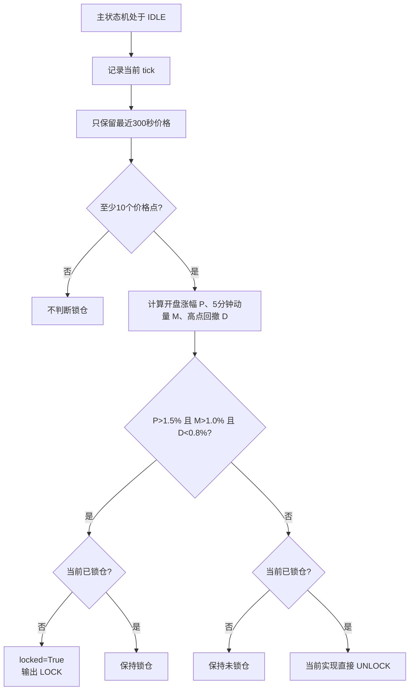

# DayTradeing v41 锁仓策略逻辑梳理

## 1. 文档范围

本文梳理 `DayTradeing_v41_stragety_miniqmt.py` 当前实际使用的锁仓逻辑。

v41 以 v40 的完整逻辑为基线独立构建，并额外增加 MA5/MA20 定时输出；它不导入或继承 v40。本文所述锁仓逻辑由 `DayTradeing_v41_stragety_miniqmt.py` 自身实现。

相关实现：

- [v41 独立策略](./DayTradeing_v41_stragety_miniqmt.py)
- [锁仓参数](../core/config.py#L73)
- [强势行情判断函数](./DayTradeing_v41_stragety_miniqmt.py#L1179)
- [主循环调用位置](./DayTradeing_v41_stragety_miniqmt.py#L1915)

## 2. 一句话定义

当前的行情锁仓机制是：

> 当股价已经明显高于开盘价，并且最近5分钟仍快速上涨，同时价格仍贴近这5分钟最高点时，冻结新的做T交易腿，避免在强势拉升阶段过早反T卖出或追随短线信号开仓。

这里的“锁仓”更准确地说是“冻结新交易腿”，不是清仓，也不是完全停止所有订单。

## 3. 当前参数

```python
LOCK_PRICE_RATIO = 0.015       # 当前价高于开盘价1.5%
LOCK_MOMENTUM_PCT = 0.010      # 最近5分钟上涨超过1.0%
LOCK_DRAWDOWN_PCT = 0.008      # 距最近5分钟高点回撤不足0.8%
LOCK_LOOKBACK_SEC = 300        # 动量与高点观察窗口：5分钟
LOCK_COOLDOWN_SEC = 60         # 计划要求解锁条件稳定60秒
```

注意：源码采用严格比较符号：

- 涨幅必须 `> 1.5%`，等于1.5%不满足。
- 5分钟动量必须 `> 1.0%`，等于1.0%不满足。
- 高点回撤必须 `< 0.8%`，等于0.8%不满足。

日志只显示到有限小数位，因此日志显示 `P+1.5%` 或 `M 1.00%` 时，内部真实值可能略高于显示值。

## 4. 三个锁仓条件

系统保存最近 `LOCK_LOOKBACK_SEC` 秒的价格：

```text
prices = 最近5分钟价格序列
p5     = 序列中的第一笔价格
pn     = 当前价格
dh     = 序列中的最高价格
open   = 当日开盘价
```

然后计算三个条件。

### 4.1 条件1：当日已经明显上涨

```text
pn > open × (1 + LOCK_PRICE_RATIO)
```

当前参数下：

```text
当前价 > 开盘价 × 1.015
```

作用：只有当日涨幅已经超过约1.5%时，才考虑进入强势锁仓。它是第一层日内趋势过滤，防止开盘价附近的普通波动触发锁仓。

### 4.2 条件2：最近5分钟仍在快速上涨

```text
(pn - p5) / p5 > LOCK_MOMENTUM_PCT
```

当前参数下：

```text
最近5分钟涨幅 > 1.0%
```

作用：确认上涨不是单纯由早盘累计涨幅造成，而是当前5分钟窗口仍有向上动量。

这里的 `p5` 是窗口中保留下来的最早一笔 tick 价格，不一定恰好落在整分钟边界。

### 4.3 条件3：当前价仍贴近5分钟高点

```text
(dh - pn) / dh < LOCK_DRAWDOWN_PCT
```

当前参数下：

```text
当前价距离最近5分钟最高价的回撤 < 0.8%
```

作用：区分“仍在强势区”与“已经明显冲高回落”。即使前5分钟累计涨幅很大，如果当前价已经从高点回撤0.8%或更多，也不再满足锁仓条件。

### 4.4 最终条件

```text
should_lock = 条件1 AND 条件2 AND 条件3
```

三个条件必须同时成立。

## 5. 状态变化



进入锁仓时保存：

```python
locked = True
lock_since = 当前时间
lock_reason = "P+...% M ...% D ...%"
```

典型日志：

```text
[09:38:41] [LOCK] P+1.6% M 2.03% D 0.00%
```

其中：

- `P`：当前价相对开盘价的涨幅。
- `M`：最近5分钟窗口的涨幅。
- `D`：当前价相对最近5分钟最高价的回撤。

## 6. 锁仓对交易状态机的实际影响

### 6.1 会被冻结的行为

锁仓状态通过 `_new_leg_block_reason()` 统一阻止以下新交易腿：

| 交易行为 | 锁仓影响 |
|---|---|
| REV-T 从 `IDLE` 开始冲高监测 | 阻止 |
| REV-T 已准备卖出，但尚未下单 | 撤销准备，回到 `IDLE` |
| REV-T 阶梯追加卖出 | 阻止 |
| FWD-T 从 `IDLE` 开始探底监测 | 阻止 |
| FWD-T 已准备买入，但尚未下单 | 撤销准备 |
| FWD-T 阶梯追加买入 | 阻止 |
| MOM 在空闲状态识别到新的上涨/下跌信号 | 阻止 |
| MOM 已准备开新腿，但尚未下单 | 撤销准备 |
| 一笔T完成后自动恢复下一轮交易 | 锁仓期间不恢复 |

关键入口：

- [REV-T/FWD-T 空闲态入口](./DayTradeing_v41_stragety_miniqmt.py)
- [REV-T 下单前复核](./DayTradeing_v41_stragety_miniqmt.py)
- [FWD-T 下单前复核](./DayTradeing_v41_stragety_miniqmt.py)
- [MOM 空闲态入口](./DayTradeing_v41_stragety_miniqmt.py)

### 6.2 不会被冻结的行为

锁仓不应妨碍已经存在的交易腿完成闭环：

| 已有交易腿 | 锁仓期间行为 |
|---|---|
| REV-T 已经卖出，等待买回 | 继续监控并允许买回 |
| FWD-T 已经买入，等待卖回 | 继续监控并允许卖回 |
| MOM 已经卖出，等待买回 | 继续监控并允许买回 |
| MOM 已经买入，等待卖回 | 继续监控并允许卖回 |
| 尾盘强制平掉未闭合交易腿 | 继续执行 |

因此，行情锁仓的原则是：

> 不再增加风险敞口，但允许现有敞口正常收尾。

## 7. 实际逐 tick 调用顺序

普通交易循环中的主要顺序是：

```text
1. 获取最新 tick
2. 更新日内均价
3. 更新涨停保护
4. 运行 MOM 状态机
5. 如果主状态机是 IDLE，评估强势锁仓
6. 运行 REV-T/FWD-T 主状态机
7. 输出心跳
```

这带来两个重要结果：

1. 强势锁仓只在主状态机处于 `IDLE` 时更新。主交易腿已经进入 `SPIKING/SOLD/DIPPING/BT_BOUGHT` 等状态后，不再重新计算强势锁仓。
2. MOM 在当前 tick 中先于强势锁仓判断运行。因此，新出现的强势锁仓对 MOM 存在一个 tick 的生效延迟；主 REV-T/FWD-T 则在同一 tick 中立即受到锁仓影响。

调用证据见 [主循环](./DayTradeing_v41_stragety_miniqmt.py)。

## 8. “锁仓”与另外两种保护的区别

当前策略中有三种容易混淆的冻结机制。

### 8.1 强势行情锁仓 `[LOCK]`

- 由本文5个 `LOCK_*` 参数控制。
- 依据开盘涨幅、5分钟动量和高点回撤触发。
- 主要冻结新交易腿。
- 条件消失后允许解锁。

### 8.2 数据异常锁定 `[TRADE-LOCK]`

- 在日线数据缺失、过期或初始化异常时触发。
- 会清空当日信号，将 `do_short/do_long` 都设为 `False`，并将策略标记为未初始化。
- 属于 fail-closed 安全保护，强度高于普通行情锁仓。
- 不由本文5个参数控制。

实现见 [数据异常锁定](./DayTradeing_v41_stragety_miniqmt.py)。

### 8.3 涨停保护 `LIMIT-UP-GUARD`

- 根据当前价相对昨收的涨幅判断是否接近涨停。
- 触发后冻结所有新交易腿。
- 开板回落后还要稳定保持一段时间才释放。
- 使用独立参数，不由本文5个参数控制。

实现见 [涨停保护](./DayTradeing_v41_stragety_miniqmt.py)。

## 9. 当前60秒冷却的实现问题

配置中的设计意图是：锁仓条件消失后，等待 `LOCK_COOLDOWN_SEC=60` 秒再解锁，避免价格在阈值附近造成反复 `LOCK/UNLOCK`。

但当前代码顺序使这个60秒冷却实际上没有生效：

```text
1. 锁仓条件第一次变为 False。
2. lock_cooldown_until 初始值仍为0。
3. cool_ok = 当前时间 >= 0，结果为 True。
4. 代码立即执行 UNLOCK。
5. 随后的代码又把 lock_cooldown_until 清零。
6. 冷却计时器没有机会启动。
```

相关代码见 [解锁与冷却实现](./DayTradeing_v41_stragety_miniqmt.py)。

历史日志也符合这一现象：

- 2026-08-28 的一份 v40 日志中，多次锁仓只持续2～11秒。
- 同一日志中，解锁后2～9秒又重新锁仓。
- 2026-09-02 日志中出现锁仓1秒后立即解锁。

日志证据：

- [2026-08-28 v40 日志](./logs/DayTradeing_v40_601869_20260828_094137.log#L32)
- [2026-09-02 v40 日志](./logs/DayTradeing_v40_601869_20260902_092826.log#L100)

### 9.1 预期的冷却逻辑

合理的预期流程应当是：

```text
锁仓条件持续成立
    → 保持锁仓，并清除解锁倒计时

锁仓条件第一次不成立
    → 启动60秒解锁倒计时，仍保持锁仓

60秒内条件重新成立
    → 取消解锁倒计时，继续锁仓

条件连续60秒不成立
    → 执行UNLOCK
```

当前源码尚未实现上述连续稳定60秒的效果。

## 10. 历史日志中的完整案例

2026-09-02：

```text
09:38:41  P+1.6%、5分钟动量2.03%、回撤0% → LOCK
09:41:01  价格已经超过REV-T触发价，但仍处于LOCKED
09:44:32  UNLOCK
09:44:32  立即进入REV-T冲高监测
09:44:41  回落确认并卖出
10:08:15  正常买回，完成反T
```

这说明锁仓确实会推迟 REV-T 的启动，但不会阻止锁仓解除后的交易，也不会阻止已经卖出后的买回闭环。

详见 [2026-09-02 v40 日志](./logs/DayTradeing_v40_601869_20260902_092826.log#L33)。

## 11. 当前逻辑总结

```text
触发对象：强势上涨行情
触发条件：当日涨幅 + 5分钟动量 + 贴近窗口高点，三条件同时成立
保护目标：避免强势拉升阶段过早反T卖出或新开其他交易腿
冻结范围：新交易腿
允许范围：已有交易腿买回、卖回和强制收尾
更新时机：仅主状态机IDLE时
解除条件：三条件任一不再成立
当前缺陷：配置的60秒稳定解锁冷却没有真正生效
```

从业务语义上看，建议将这套机制理解为“强势行情新腿保护”，而不是“全策略停止交易”。
