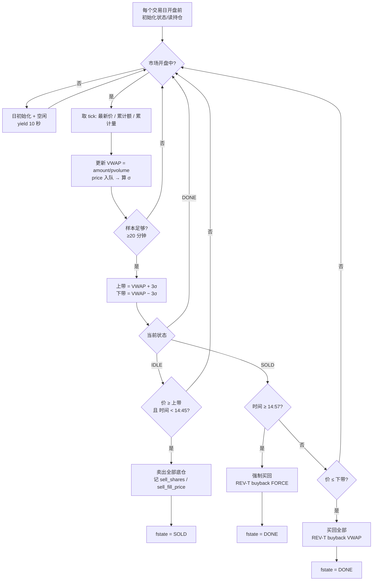

# CaptureT_v1 原理、流程与实测结果

策略文件：`Stragety/MiniQMT_Stragety/DayT/CaptureT_v1_RangeCapture.py`
注册别名：`capture_v1`　命名族：`CaptureT_v1_*`

---

## 一、它想解决什么问题

旧系列（`DayTradeing_v13-v41`、`DayT_v39-v058`）都用 `T_TARGET_VALUE` 把每条腿
锁在 **1 手**，在几百元的标的上，1 手只占底仓 10%——**每笔做 T 的绝对额太小，
赚的钱盖不住手续费**。

CaptureT_v1 换一个问法：

> **一天当中真正可被规则拿走的振幅有多少？**

先把这个上限算清楚，再设计规则去逼近它。这也是它和旧系列最根本的区别：
旧系列在调触发价，它在改**仓位口径**和**交易频率**。

配套的度量工具是 `analysis/capturet_v1_lab_20260919.py`（评测台），
它先算「完美预知上界」，再把每个规则表达成上界的百分比（捕获率）。

---

## 二、核心原理：把当日价格放在 VWAP ± 3σ 的两条带子里看

### 2.1 三个量，全部只用「当日已走出的数据」

| 量 | 算法 | 数据来源 |
|---|---|---|
| **VWAP**（成交量加权均价） | `amount ÷ pvolume` | tick 的**当日累计**成交额与成交量 |
| **σ**（价格标准差） | 当日每分钟收盘价的滚动标准差 | 自己累积的 `prices` 名单 |
| **上/下带** | `VWAP ± K_SIGMA × σ` | 上面两个量 |

**关键点：三个量都严格只用「截至当前这一分钟」的数据**，不含未来信息。
VWAP 用累计值天然满足；σ 只对已发生的分钟做 `np.std`。

### 2.2 为什么用 VWAP 而不是开盘价

| 基准 | 问题 |
|---|---|
| 开盘价 | 只反映竞价那一瞬间，之后几小时的成交与它无关 |
| VWAP | 反映**当日真实成交均价**，是「贵/便宜」的天然刻度 |
| VWAP ± kσ | 再叠一层**当日波动尺度**，使阈值随行情自动松紧 |

所以「价格高于 VWAP + 3σ」= **贵得异常**（不是贵一点点），
「低于 VWAP − 3σ」= **便宜得异常**。策略在这两个极端上做反向。

### 2.3 为什么 σ 要用「当日已发生」的而非历史 ATR

日内波动有明显的时段结构（开盘、午休后波动大）。
用**当日已实现**的 σ 会自动适配当天的实际节奏：
平静的日子 σ 小、带子窄，仍然等得到；躁动的日子 σ 大、带子宽，不轻易出手。

---

## 三、状态机

只有两个状态（外加一个终态），**每个交易日最多走一趟**：

| 状态 | 含义 | 迁移条件 |
|---|---|---|
| `IDLE` | 持有底仓，等卖点 | 价格 ≥ 上带 **且** 时间 < 14:45 → 卖出 → `SOLD` |
| `SOLD` | 已卖出底仓，等买点 | 价格 ≤ 下带 → 买回 → `DONE`；<br>时间 ≥ 14:57 → **强制买回** → `DONE` |
| `DONE` | 当日收工 | 不再交易（重置发生在下一个交易日） |

**为什么一天只走一趟**：评测台测过「多趟」变体，
手续费按趟数线性增加而每趟可捕获的幅度不变，**净结果为负**，
所以显式限制为一趟。

---

## 四、运行流程图

### 4.1 主循环（Mermaid）



### 4.2 一天的时序（ASCII 示意）

```
时间轴  09:30 ──────────────────────────────────────────────── 15:00
        │                                                         │
  σ 样本 │←─ 前 20 分钟只累积，不出手 ─→│                          │
        │                               │                          │
  价格   │      ╱╲   ← 盘中冲高           ╱╲                       │
  VWAP→  │────╱──╲──────────────────────╱──╲────────────          │
  上带    │───╱────╲────────────────────╱────╲───────────  ③      │
  下带    │  ╱      ╲                  ╱      ╲           ②      │
        │                                ↓                    ↓
  动作   │                          ① 卖出              ②买回 / ③强平
        │                                                         │
        └── 14:45 后不再开新仓 ────── 14:57 强制平回 ─────────────┘
```

① 价格触及 **VWAP + 3σ** → 全仓卖出
② 价格回到 **VWAP − 3σ** → 全仓买回（正常闭合）
③ 到了 **14:57** 仍未触发② → 无条件买回（保证当日仓位归位）

---

## 五、参数

| 参数 | 值 | 作用 | 为什么是这个值 |
|---|---:|---|---|
| `K_SIGMA` | **3.0** | 触发阈值的 σ 倍数 | 在 IS-1 上用网格选型后冻结（见第六节敏感性） |
| `MIN_SIGMA_SAMPLES` | 20 | 算 σ 所需最少分钟数 | 样本太少 σ 不稳 |
| `WARMUP_MINUTES` | 30 | 开盘后先积累样本 | 避开开盘竞价噪声 |
| `NO_NEW_ENTRY_CUTOFF` | 14:45 | 停止开新仓 | 留 12 分钟给买回 |
| `FORCE_FLAT_TIME` | 14:57 | 无条件平回 | 保证「当日仓位必归位」 |

仓位（由回测口径决定，非策略内硬编码）：

- 底仓 = **1000 股**（三标的通用测试）或 **800 股**（601869 实盘口径）
- 每条腿 = **底仓的一半**（500 股 / 400 股）

---

## 六、与 v0561 / v0562 的架构差异

| 维度 | v0561 / v0562 | **CaptureT_v1** |
|---|---|---|
| 触发基准 | 日线 ATR + 开盘价 × 系数 | **当日 VWAP ± kσ** |
| 波动尺度 | 日线 ATR（隔夜更新一次） | **当日已实现 σ（逐分钟更新）** |
| 每腿股数 | `T_TARGET_VALUE=40000` 反推 → 高价股锁死 1 手 | 由**仓位口径**决定（底仓的一半） |
| 每日趟数 | 多趟（有再入场、ATR 重锚） | **一趟** |
| 每日期望 | 抓小幅多次 | 抓极端一次 |
| 依赖模块 | 5 个 core 模块 + 检查点 | 3 个 core 模块，无检查点 |

一句话概括：**v0561/v0562 用「日线的尺」量价格，CaptureT_v1 用「当日的尺」量价格。**

---

## 七、实测结果（全部为实测，非估计）

### 7.1 601869 · 每日策略重置 · 账户连续 · 半仓（2026-01-01 ~ 09-18）

口径：初始 800 股（约 10 万元 @115.19）+ 10 万现金；每笔 T 400 股；
数据全部取自 RedisQMT 桥接；单边 0.05%、无滑点。

| 策略 | 期末资产 | 相对一直持有 | 反T/正T周期 | T达成率 | 未闭合日 | 手续费 |
|---|---:|---:|---:|---:|---:|---:|
| v0561 | 461,586.00 | −2,406.00 | 95 / 103 | 41.95% | 102/174 | 17,196.70 |
| v0562 | 429,982.00 | −34,010.00 | 70 / 103 | 39.03% | 76/174 | 12,187.82 |
| **CaptureT_v1** | **479,652.00** | **+15,660.00** | 23 / 0 | 6.61% | 0/174 | 2,958.32 |

一直持有对照：**463,992.00 元**。

### 7.2 三标的每日重置（2026-01-01 ~ 09-11，评测台口径）

累计超额收益：

| 策略 | OOS-A | IS-1 | IS-2 |
|---|---:|---:|---:|
| CaptureT_v1 | **+0.02%** | **+0.29%** | **+1.88%** |
| v0562 | −0.47% | +1.00% | −0.98% |
| v056 正T冻结 | −0.31% | −0.86% | −0.95% |

**CaptureT_v1 是唯一三区间全正的。**

---

## 八、必须一起看到的四条否定证据

单看 7.1 会高估这个策略。以下四条检验**都指向同一个方向**：

### ① 统计上不显著

23 个已闭合周期：合计 +15,660，单笔均值 **+681**，标准差 **3,024**，
标准误 631，**t = 1.08**（远未达显著）；胜率 65%。

| 剔除 | 合计 |
|---|---:|
| 不剔除 | +15,660 |
| 剔除最大一笔（+9,816） | +5,844 |
| 剔除最大两笔 | **+2,268** |

**对离群值高度敏感。**

### ② 跑赢的方式与原设计不符

**全部 23 笔平仓都发生在 14:57:00** —— `VWAP − 3σ` 的买回信号**从未触发过**。
实际形态是「冲到 VWAP+3σ 就卖出，然后一路持有到尾盘强平买回」。

**这不是原设计的自洽闭环，而是强平规则兜底的结果。**

### ③ K_SIGMA 敏感性：会翻号

| K | 相对持有 | 周期数 |
|---|---:|---:|
| 2.0 | −17,864 | 95 |
| 2.5 | −8,088 | 62 |
| **3.0** | **+15,660** | 23 |
| 3.5 | +9,892 | 8 |
| 4.0 | +2,684 | 1 |

K ≥ 3.0 为正、K ≤ 2.5 为负；且**交易越多越差**。

### ④ 跨标的不能复现（决定性）

同一口径套到 11 个其它标的（2026-01-05 ~ 09-11）：

| 正超额 | 负超额 |
|---|---|
| 600276.SH **+3,392** · 002594.SZ **+1,425** · 000001.SZ **+88** | 000651 −180 · 601318 −224 · 600887 −510 · 600036 −1,221 · 600030 −1,428 · 601899 −1,694 · 002415 −2,048 · 601012 −2,430 |

**3/11 为正，合计 −4,830，均值 −439，中位 −510。**

> **结论：601869 的 +15,660 是分布里有利的尾部，不是可复现的效应。**

---

## 九、两个结构性特征：只有反T、且 84% 的交易日不出手

### 9.1 只有反T，没有正T

策略里只有 `REV-T sell`（先卖）与 `REV-T buyback`（买回）两个标签，
**没有任何 `FWD-T`**。这是设计选择：

- **反T卖的是底仓，不占现金**；
- **正T必须先买**，受现金约束；且 A股 T+1——当天买的不能当天卖，
  所以正T的卖出必须卖底仓，**股数被底仓封顶**，相对反T没有额外优势；
- 对 11,638 元现金的实盘账户，一手 601869 要 47,399 元，**正T在数学上不可行**。

代价有多大？按「当日第一个触及哪条带」分类（601869，174 个交易日）：

| 当日第一个极值 | 天数 | 占比 |
|---|---:|---:|
| 先触**上带**（现策略做反T） | 23 | 13% |
| 先触**下带**（本该做正T） | **6** | **3%** |
| **两侧都没触及** | **147** | **84%** |

补上正T分支最多多交易 **6 天（3%）**，对结论影响很小。

**这个推断已经实测过了。** `CaptureT_v2_Symmetric.py`（注册名 `capture_v2`）
在完全相同的口径下补上了正T 分支，结果不是「影响很小」，而是**变差**：

| | v1（只有反T） | v2（反T + 正T） |
|---|---:|---:|
| 反T 闭合周期 | 23 | 21 |
| 正T 闭合周期 | 0 | 6 |
| **相对一直持有（净费）** | **+12,701.68** | **+9,581.56** |

正T 腿本身 6 笔合计 **+1,646 元、是正的**，但它把同期反T 从 23 笔削到 21 笔，
**少赚 4,468 元**。原因：**一天只允许一趟**，先触下带就做正T，
当天再冲上带就做不了反T 了——**两条腿不是互补的，是互斥的**。

而且正T 的手数被现金压着走：底仓和现金都是 10 万元级别，股价涨到 300 元以上，
400 股的腿就只剩 200–300 股能买（实测 400 → 200）。
**反T 卖底仓、不占现金，这一点上是结构性优势。**

**更进一步：只做正T 也不行。** `CaptureT_v3_ForwardOnly.py`（注册名 `capture_v3`）
把上带那一侧整个删掉、只留正T，同样口径下：

| 版本 | 相对一直持有（净费） | 做T日均超额 |
|---|---:|---:|
| v1 只做反T | **+12,701.68** | +0.0376% |
| v2 反T+正T | +9,581.56 | +0.0283% |
| **v3 只做正T** | **+367.52** | +0.0011% |

v3 在 19 万元账户上一年只做出 367.52 元——**等于零**。
跨区间看 v3 还翻号（Q1 +1,044 / Q2 +3,146 / Q3 **−3,496**），
而 v1 三段全部为正。

> **结论：这条规则的价值几乎全部在反T 那一侧。
> 上带（VWAP+3σ）卖出 > 什么都不做 > 下带（VWAP−3σ）买入。**
> 完整报告：`analysis/dayt_capturet_v2_symmetric_20260920/README.md`

### 9.2 真正的问题是 84% 的交易日空转

**3σ 阈值把策略压到了极低频**：一年 174 天里 147 天一次都不出手。
这直接解释了：

- T达成率只有 **6.61%**（底仓 800 股、一年仅 23 个周期 × 400 股）
- 一年只有 23 笔交易 → **样本量注定无法在统计上确立任何结论**（t = 1.08）

而且**放宽阈值不能解决**——K 敏感性显示：

| K | 交易周期 | 相对持有 |
|---|---:|---:|
| 2.0 | 95 | **−17,864** |
| 2.5 | 62 | −8,088 |
| **3.0** | **23** | **+15,660** |
| 3.5 | 8 | +9,892 |

**放宽到 2σ 能把交易数从 23 提到 95，但结果从 +15,660 掉到 −17,864。**
也就是说：**只有最极端的偏离才有效，而那样的机会一年只有二十几次。**

> **低频既是它的收益来源，也是它的天花板。**

---

## 十、一句话总结

**CaptureT_v1 用「当日 VWAP ± 3σ」把交易压缩到每天最多一趟、只在极端偏离处出手，
是这一系列候选里唯一在三区间全正的策略；但它跑赢持有的那一次经四层检验后不能复现
（跨标的 3/11 为正），因此它是「最不差的候选」，不是可依赖的收益来源。**

---

## 十一、复现

```powershell
# 半仓 / 账户连续 / 每日策略重置 的三策略对比（含逐笔明细）
python analysis/backtest_redis_halfposition_20260101_20260918.py

# 评测台：上界、规则族、跨区间选型与验证
python analysis/capturet_v1_lab_20260919.py --no-validate
```

相关文件：

- 策略：`Stragety/MiniQMT_Stragety/DayT/CaptureT_v1_RangeCapture.py`
- 半仓回测报告：`analysis/dayt_redis_halfposition_20260101_20260918/README.md`
- 评测台与结论：`analysis/capturet_v1_lab_20260919/README.md`
- 可执行方案：`analysis/capturet_v1_lab_20260919/BEST_ACHIEVABLE.md`
