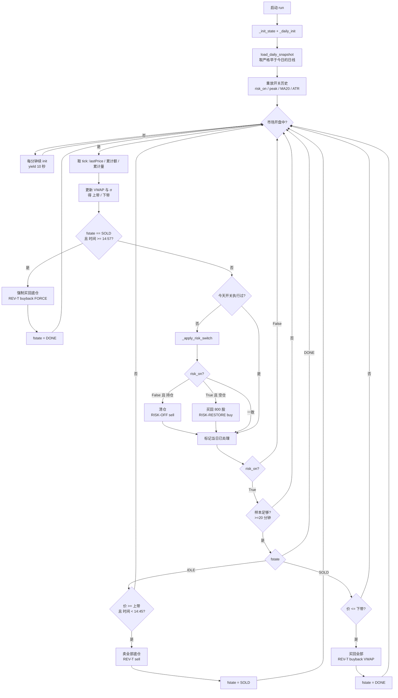

# CaptureT_v4 原理、流程与实测结果

策略文件：`Stragety/MiniQMT_Stragety/DayT/CaptureT_v4_TrendGuarded.py`
注册别名：`capture_v4`　命名族：`CaptureT_v4_*`
前作：[`CaptureT_v1_原理说明.md`](CaptureT_v1_原理说明.md)（v1/v2/v3 的日内内核）

---

## 一、它想解决什么问题

v1/v2/v3 是同一套日内规则（VWAP ± 3σ）的三个方向变体，实测结果：

| 版本 | 方向 | 相对一直持有 |
|---|---|---:|
| v1 | 只做反T | +12,701.68 |
| v2 | 反T + 正T | +9,581.56 |
| v3 | 只做正T | +367.52 |

**三个版本共享一个从未被检验的前提：底仓永远满着不动。**

而这个前提的代价在 2026 年被真实收过一次：601869 从 **6/24 的 579.71
跌到 8/3 的 262 附近，回撤 −54.8%**。底仓 800 股在这一波里蒸发了约 **25 万元**——
是 v1 全年超额收益（1.27 万）的 **20 倍**。

> **结论：真正有量级的杠杆不是日内做T，是底仓的风控。**
> 只换方向只能让结果在 +368 ~ +12,702 之间挪；加一层风控，量级变成 +88,332。

v4 就是把这个判断实现出来：**保留 v1 的日内反T，在外面套一层日线风控开关。**

---

## 二、两层结构

v4 是**两层**的，两层用完全不同的频率和数据：

```
┌─ 外层：日线风控开关 ────────────────────────────── 每天一次 ─┐
│  数据：日线 OHLC（截至昨日）                                 │
│  决定：今天底仓该不该在（risk_on ∈ {True, False}）           │
│  动作：清仓 / 买回 800 股                                    │
│  频率：低（174 个交易日里只触发了 34 次）                    │
├─ 内层：日内反T ─────────────────────────────── 每分钟一次 ─┤
│  数据：当日 tick 的累计成交额/量 + 分钟收盘价序列            │
│  决定：VWAP ± 3σ 有没有被触及                                │
│  动作：卖底仓 / 买回                                         │
│  频率：极低（一年 23 次，只有持有底仓时才可能发生）          │
└──────────────────────────────────────────────────────────────┘
```

**外层是主，内层是辅**：外层说清仓，当天内层直接不启动（没有底仓可卖）。

---

## 三、外层：日线风控开关

### 3.1 三个量，全部只用「截至昨日」的日线

| 量 | 算法 | 说明 |
|---|---|---|
| **ATR(14)** | 近 14 日 `(high − low)` 的均值 | 当日的波动尺度 |
| **peak** | 历史最高**收盘价** | 跟踪止盈的锚 |
| **MA20** | 近 20 日收盘均值 | 回场的门槛 |

阈值：`止损线 = peak − K_ATR × ATR`，`K_ATR = 3.0`。

### 3.2 状态机（两个状态）

| 状态 | 含义 | 迁移条件 |
|---|---|---|
| `risk_on = True` | 持有底仓，日内可以跑反T | 昨收 < `peak − 3×ATR` → `risk_on = False`（清仓） |
| `risk_on = False` | 空仓，日内不做T | 昨收 > `MA20` → `risk_on = True`（买回 800 股） |

**出场用 ATR 跟踪止损，进场用均线**。这是一个不对称设计，有意为之：

- 出场要**快**——跌破就认，不等反弹；
- 进场要**慢**——必须站上均线才算企稳，避免在下跌中途反复接刀。

### 3.3 为什么这样能塞进「每日重置」架构（关键工程点）

本系列有一个硬约束：**每个交易日重建策略实例，任何跨日状态全部丢失。**
所以「今天该不该持有底仓」这个状态，理论上没地方存。

v4 的解法是：**把开关状态定义成日线序列的纯函数，不存，每天早上重放出来。**

```python
risk_on, peak = True, close[0]
for i in range(n):                      # 从最早那根日线走到昨天
    peak = max(peak, close[i])
    atr  = mean(high[i-13:i+1] - low[i-13:i+1])
    ma   = mean(close[i-19:i+1])
    if risk_on:
        if close[i] < peak - 3*atr: risk_on = False     # 触发止损
    elif close[i] > ma:             risk_on = True      # 回场
```

跑完这个循环，`risk_on` 就是**今天**该用的值。这段代码在 `_daily_init()` 里
执行一次，用了 `DAILY_LOOKBACK = 280` 根日线——足够覆盖任意长的清仓期。

**这是本系列第一次使用日线数据。** 前三个版本只看当日 tick。

### 3.4 无未来函数

- `load_daily_snapshot` 在回放框架里自带断言，保证返回的最后一根日线**严格早于当日**；
- 信号在**开盘前**算完，订单在当日**第一笔 tick**（≈09:30 那根 1 分钟线）成交；
- 每个交易日的开关只执行一次（`risk_switch_done` 标记）。

---

## 四、内层：日内反T（与 v1 完全相同）

只在 `risk_on = True`（持有底仓）时运行。

| 量 | 算法 |
|---|---|
| **VWAP** | tick 的当日累计 `amount ÷ pvolume` |
| **σ** | 当日已发生的分钟收盘价的 `np.std` |
| **上/下带** | `VWAP ± 3σ` |

| 状态 | 迁移条件 |
|---|---|
| `IDLE` | 价 ≥ 上带 **且** 时间 < 14:45 → 卖全部底仓 → `SOLD` |
| `SOLD` | 价 ≤ 下带 → 买回 → `DONE`；<br>时间 ≥ 14:57 → **强制买回** → `DONE` |
| `DONE` | 当日收工 |

细节与前作一致，见 [`CaptureT_v1_原理说明.md`](CaptureT_v1_原理说明.md) 第三、四节。

---

## 五、运行流程图

### 5.1 主循环（Mermaid）



### 5.2 一天 / 一年的时序（ASCII）

**一天：**

```
时间轴  09:30 ──────────────────────────────────────────────── 15:00
        │                                                          │
  外层   │◄ 开盘前已算好 ─┤ 09:30 第一笔 tick 执行清仓/回场          │
        │                                                          │
  内层   │← 前 20 分钟只累积样本，不出手 →│                         │
  价格   │      ╱╲   ← 盘中冲高            ╱╲                      │
  VWAP→  │────╱──╲───────────────────────╱──╲────────────         │
  上带    │───╱────╲─────────────────────╱────╲───────────  ③     │
  下带    │  ╱      ╲                   ╱      ╲          ②     │
  动作   │                            ① 卖出           ②买回/③强平│
        └── 14:45 后不开新仓 ─────── 14:57 强制平回 ──────────────┘
```

**一年（601869，2026，实测的 34 次开关事件）：**

```
115 ──────────────────────────────────────────────────────► 455
  │                                                          │
  │  ①1月: 4 次翻仓（净亏 ~2 万）                              │
  │     01-13 卖 / 01-20 买 / 01-23 卖 / 01-27 买              │
  │                                                          │
  │           ②7月3日 475.08 清仓 ←── 决定性的一次            │
  │                    │                                     │
  │                    │   空仓 26 个交易日                   │
  │                    │   躲开 −54.8% 的崩盘（+112,546）     │
  │                    ▼                                     │
  │              8月11日 335.92 买回                          │
  │                                                          │
  │                              ③8月后 29 次翻仓（−11,804）   │
  └──────────────────────────────────────────────────────────┘

  段① 上涨段  −13,440      段② 空仓段  +112,546      段③ 回场后  −11,804
```

---

## 六、参数

### 6.1 外层（日线风控）

| 参数 | 值 | 作用 | 为什么是这个值 |
|---|---:|---|---|
| `ATR_PERIOD` | **14** | 波动尺度窗口 | 教科书默认 |
| `K_ATR` | **3.0** | 止损的 ATR 倍数 | 教科书默认；扫过 1.0~6.0，**k ≥ 2.0 整段为正** |
| `MA_REENTRY` | **20** | 回场门槛 | 教科书默认 |
| `DAILY_LOOKBACK` | **280** | 取多少根日线重放 | 覆盖任意长度的清仓期 |
| `BASE_TARGET_SHARES` | **800** | 回场买回多少股 | 必须与账户底仓一致 |

### 6.2 内层（日内反T，与 v1 相同）

| 参数 | 值 | 作用 |
|---|---:|---|
| `K_SIGMA` | 3.0 | 触发阈值的 σ 倍数（在 IS-1 上选定后冻结） |
| `MIN_SIGMA_SAMPLES` | 20 | 算 σ 所需最少分钟数 |
| `WARMUP_MINUTES` | 30 | 开盘后先积累样本 |
| `NO_NEW_ENTRY_CUTOFF` | 14:45 | 停止开新仓 |
| `FORCE_FLAT_TIME` | 14:57 | 无条件平回 |

### 6.3 参数是怎么选的（必须披露）

`ATR(14)`、`K=3.0`、`MA20` **全部是教科书默认值，没有做任何搜索**。
在「回撤 x% 清仓」和「ATR 跟踪止损」两族之间做选择时，用的是**稳健性**而非最高分：

| 「回撤 x% 清仓」的触发 | 5% | 10% | 15% | 20% | **25%** | 30% | 35% | 40% | 50% |
|---|---:|---:|---:|---:|---:|---:|---:|---:|---:|
| 全区间超额(元) | −31,110 | +24,026 | +48,087 | +67,051 | **+104,015** | **−282** | +23,175 | −30,410 | −42,086 |

**25% 给 +104,015，30% 掉到 −282** —— 锯齿状，典型的曲线拟合形状，**弃用**。

| 「ATR k 倍跟踪」 | 1.0 | 1.5 | 2.0 | 2.5 | **3.0** | 4.0 | 5.0 | 6.0 |
|---|---:|---:|---:|---:|---:|---:|---:|---:|
| 全区间超额(元) | −36,838 | −26,853 | +62,629 | +62,109 | **+72,000** | +59,448 | +35,201 | +32,695 |

**k ≥ 2.0 整段为正** —— 这一族被选中。注意它的最高分（+72,000）**低于**被弃用的回撤族（+104,015）。
**规则是按稳健性选的，不是按最高分选的。**

---

## 七、与 v1 / v2 / v3 的架构差异

| 维度 | v1 / v2 / v3 | **CaptureT_v4** |
|---|---|---|
| 数据频率 | 只用当日 tick | **当日 tick + 日线** |
| 底仓 | 永远满仓 | **可被风控清空** |
| 跨日状态 | 无 | 无（**开关由日线重放，不存状态**） |
| 台账 | 所有成交进 ExecutionBook | **风控腿不进**（`RISK_LABELS`） |
| 空仓 | 不可能 | **合法状态**，`_daily_init` 不再因空仓锁死 |
| 每年交易次数 | 23（做T） | 23（做T）+ 34（风控） |

### 两个必须改的地方（都是空仓带来的）

1. **`_daily_init` 不能因空仓锁死。**
   v1 把「没有可卖底仓」当成致命错误直接 `_lock_all_trading`。v4 里空仓是
   风控**主动造成**的合法状态（`risk_on=False`），或今天正好是回场日。

2. **风控腿不进 `ExecutionBook`。**
   清仓今天做、回场可能隔一周，而 `ExecutionBook` 随每日重置一起重建——
   昨天的 `RISK-OFF` 记录今天已不存在，`RISK-RESTORE` 会被判成
   「平掉不存在的腿」直接抛错。风控的盈亏本来就体现在账户权益里，
   不需要也不应该由 T 台账记账。

---

## 八、实测结果（全部实测，非估计）

### 8.1 601869 · 每日策略重置 · 账户连续（2026-01-01 ~ 09-18）

口径：初始 800 股 + 10 万现金；1 分钟线取自 RedisQMT 桥接；
手续费按日结算实扣（单边 0.05%），滑点 0。

| 版本 | 期末资产 | 相对一直持有 | 反T周期 | 风控事件 | 手续费 |
|---|---:|---:|---:|---:|---:|
| **v4** | **552,323.57** | **+88,331.57** | 14 | 34 | 6,788.43 |
| v1 | 476,693.68 | +12,701.68 | 23 | — | 2,958.32 |
| v2 | 473,573.56 | +9,581.56 | 21 (+6 正T) | — | 3,256.44 |
| v3 | 464,359.52 | +367.52 | 0 (+6 正T) | — | 414.48 |

一直持有对照：**463,992.00 元**。

**v4 = v1 的 7.0 倍。**

### 8.2 钱是从哪来的：三段拆解

把整个区间按**那次清仓**切成三段，逐段对比「v4 账户」与「一直持有」：

| 区间 | v4 账户变化 | 一直持有变化 | **v4 − 持有** |
|---|---:|---:|---:|
| ① 01-05 → 07-03（上涨段） | +274,472 | +287,912 | **−13,440** |
| ② 07-03 → 08-11（**空仓 26 个交易日**） | **+1,218** | **−111,328** | **+112,546** |
| ③ 08-11 → 09-18（回场后） | +83,452 | +95,256 | **−11,804** |
| **合计** | | | **+87,302** |

**这张表是整个策略最诚实的一张：**

- **① 上涨段 v4 输给持有 13,440 元。** 因为 1 月那 4 次翻仓被反复打脸
  （01-13 卖、01-20 买、01-23 卖、01-27 买），现金从 100,000 掉到 85,198，
  持仓却一直是 800 股 —— 这一项就亏掉约 **14,800 元**。
- **② 崩盘段 v4 赚了 112,546 元。** 它几乎是空仓度过的（账户只动了 1,218），
  而持有蒸发了 111,328。**这一段的贡献是全部超额收益的 129%。**
- **③ 回场后 v4 又输给持有 11,804 元。** 8 月后 29 次翻仓，churn 净亏 + 手续费 6,788。

> **一句话：v4 在两端（上涨、震荡）都在输钱，全部的赢面来自中间那 26 天的空仓。**
> 换句话说，这不是一个「持续有效」的策略，是一个**用两次小额亏损买一次崩盘保险**的策略。

### 8.3 跨区间：一次赢、一次平、一次亏

| 版本 | Q1 (01-01~03-31) | Q2 (04-01~06-30) | Q3 (07-01~09-18) |
|---|---:|---:|---:|
| v4 | **−12,306** | +3,737 | **+96,901** |
| v1 | +3,752 | +3,737 | +5,212 |

**Q2 两行完全相同**——风控一次都没触发，v4 退化成 v1。
Q1 v4 是**亏的**。全部收益都在 Q3。

### 8.4 横截面：**v4 没通过这一关**

把**完整的 v4 策略**（日内反T + 日线风控）原样套到 11 个其它标的上，
共同窗口 2026-01-05 ~ 09-11，每个标的独立账户（10 万仓位 + 10 万现金）：

| 标的 | 区间涨跌 | v1 反T | **v4 +风控** | **v4−v1** | v4 空仓天数 |
|---|---:|---:|---:|---:|---:|
| 601869 | +312.5% | +13,406 | +88,885 | **+75,478** | 46 |
| 601012 | −38.8% | −3,280 | +25,174 | **+28,454** | 138 |
| 601318 | −24.2% | −1,047 | +20,501 | **+21,548** | 130 |
| 002594 | −14.4% | +486 | +17,795 | **+17,309** | 134 |
| 002415 | +10.8% | −2,840 | +7,090 | +9,930 | 79 |
| 600887 | −6.8% | −1,227 | −446 | +780 | 135 |
| 600276 | −32.4% | +2,606 | +3,194 | +589 | 137 |
| 600030 | −8.2% | −2,384 | −2,060 | +324 | 131 |
| 000651 | −5.0% | −1,673 | −3,721 | **−2,048** | 135 |
| 600036 | −2.4% | −2,073 | −6,269 | **−4,196** | 117 |
| 601899 | −8.9% | −2,799 | −20,604 | **−17,805** | 105 |

| 汇总 | v1 反T | v4 +风控 | v4 − v1 |
|---|---:|---:|---:|
| 为正的标的数 | **3/11** | 6/11 | **8/11** |
| 合计 | −825 | +129,539 | +130,364 |
| 均值 | −75 | +11,776 | +11,851 |
| **中位** | −1,673 | +3,194 | **+780** |

**三条统计检验全部不通过：**

| 口径 | n | 均值 | t |
|---|---:|---:|---:|
| 全部标的 | 11 | +11,851 | **1.58** |
| 剔除 601869 | 10 | +5,489 | **1.26** |
| 按**有效样本数** n_eff | 3.6 | +11,851 | **0.91** |

**为什么 n_eff 只有 3.6**：这 11 个标的在同一段行情里同涨同跌，
日收益平均两两相关 **0.21**，第一主成分解释 **32%** 的方差。
「8/11 为正」听起来像 11 次验证，**实际只相当于 4 次独立样本**。

**增量的大小几乎完全由「这个标的动了多少」决定：**

| 相关性 | 值 |
|---|---:|
| corr(风控增量, 标的区间涨跌) | **+0.80** |
| corr(空仓天数, 标的区间涨跌) | **−0.85** |

> **这个开关的行为可以一句话概括：股票跌得越多它越空仓、涨得越多它越满仓。
> 这不是「择时能力」，是「趋势跟随的机械后果」。**

**所以 601869 的 +88,885 不能推广**——它靠的是 601869 恰好是那一年
趋势最强、波动最大的标的。

---

## 九、必须一起读的三条否定证据

### ① 收益来自一次事件

34 次风控事件里，只有 07-03 → 08-11 那一对是赚钱的（+112,546），
**其余 33 次合计亏 25,244 元**（上涨段 −13,440 + 回场后 −11,804）。
**一次崩盘、一次离场。** 样本期 8.5 个月只包含**一次** −54.8% 的回撤，
没有第二个独立事件可验证。

### ② 跨区间符号不一致

v4 在 Q1 是**亏的**（−12,306）。真正有信息量的检验只有 Q3 一次，
Q2 是空转（与 v1 完全相同）。所谓「三个区间」在这里不是三次独立检验。

### ③ 8 月后每天都在翻仓

8/11 之后共 **29 次**风控事件——几乎是每个交易日翻一次仓。
这段 churn 净亏 13,206 元（手续费 6,788）。**震荡市里这个开关会被反复打脸**，
这正是「躲开一次崩盘」在更长尺度上可能退化的形态。

### ④ 跨标的不通过（决定性）

11 个其它标的上 **t = 1.58、中位 +780 元、有效样本数只有 3.6**（见 8.4 节）。
**它不是「样本小」，而是「换了标的就不成立」。**

### ⑤ 跨起始日也不通过（更决定性）

在 **5,129 只 × 12 年、45,085 个不重叠观测**的全市场面板上：

| 检验 | 结果 |
|---|---|
| 全市场平均开关超额 | **−5.99%**（中位 −2.59%、为正 45%） |
| 逐年 `corr(持有收益, 开关超额)` | **−0.98** —— 大盘跌的年份才值钱 |
| 事前特征（ER / 波动率 / 位置） | **全部无单调关系**，选不出好标的 |
| **601869 自己**，起始日滑动 | **−98.0% ~ +59.4%**，均值 −13.2% |

**同一只 601869、同一条规则、同样的 126 个交易日长度，
只把起始日挪 4 个月，超额就从 +59.4% 变成 −98.0%。**

> **我们反复引用的 +88,331.57 元，用的是 2026-01-01 这个起始日。
> 这是「一个标的 × 一个时段」的产物，不是策略。**

完整研究见 [`选股器研究结论.md`](选股器研究结论.md)。

---

## 十、一句话总结

**v4 用一层日线 ATR 跟踪止损给底仓装上风控开关，实测跑赢 CaptureT v1 7 倍
（+88,331.57 vs +12,701.68）。但三段拆解显示：上涨段它输 13,440、回场后它输 11,804，
全部赢面（+112,546）来自中间 26 天的空仓；跨标的的检验也不通过
（11 个其它标的 t = 1.58、中位 +780、有效样本数只有 3.6）。
它本质上是一个「有趋势时赚钱、无趋势时赔钱」的趋势跟随开关，
601869 恰好是那一年趋势最强的标的。**

---

## 十一、复现

```powershell
# 四版本主回测（含逐笔明细）
python analysis/backtest_capturet_v2_symmetric_20260920.py

# 跨区间验证（含 v4）→ INTERVALS.md
python analysis/backtest_capturet_v2_symmetric_20260920.py --intervals

# 择时评测台：13 标的横截面 / 崩盘归因 / 参数敏感性
python analysis/timing_lab_20260920.py

# 跨标的回测：完整 v4 策略套到 11 个其它标的上
python analysis/backtest_capturet_cross_symbol_20260920.py

# 只重生成报告，不重跑回放
python analysis/backtest_capturet_v2_symmetric_20260920.py --render
```

**相关文件**

| 文件 | 内容 |
|---|---|
| `Stragety/MiniQMT_Stragety/DayT/CaptureT_v4_TrendGuarded.py` | 策略实现 |
| `analysis/CaptureT_v4_择时策略结论.md` | 面向决策的结论（要/不要上实盘） |
| `analysis/dayt_capturet_cross_symbol_20260920/README.md` | **跨标的回测：11 个其它标的上的 v1 vs v4** |
| `analysis/backtest_capturet_cross_symbol_20260920.py` | 跨标的回测脚本 |
| `analysis/选股器研究结论.md` | **全市场 5,129 只 × 12 年：选股器为什么做不出来** |
| `analysis/screener_lab_20260920/README.md` | 选股器研究完整报告 |
| `analysis/timing_lab_20260920/README.md` | 择时研究：横截面、崩盘归因、参数敏感性 |
| `analysis/dayt_capturet_v2_symmetric_20260920/README.md` | 四版本回测主报告 |
| `analysis/dayt_capturet_v2_symmetric_20260920/INTERVALS.md` | 跨区间验证 |
| `analysis/CaptureT_v1_原理说明.md` | 内层（日内反T）的原理与流程 |
