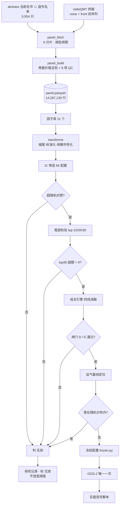

# 选股 + 择时组合策略系统：各项说明、运行流程与结果

> **一句话**：这是一套**完整建成、逐项验证、但最终没有产出可用信号**的
> 横截面选股 + 择时系统。
>
> 系统本身（数据层 / 因子库 / 组合引擎 / 撮合成本 / 评估指标 / 实盘信号脚本）
> 全部就位并通过测试；**结论是负面的** —— 在已有数据与约束下找不到可用的
> 选股因子。文档记录的是「这套东西是什么、怎么跑、跑出来什么」。

---

## 一、系统总览

### 1.1 三个层次

```
┌────────────────────────────────────────────────────────────────┐
│ 第 1 层  数据地基                                                │
│  股票池（含退市股）→ 桥接拉取 → 面板合成 + QC                     │
│  产出：14,287,130 行 / 5,498 只 / 2009-06 ~ 2026-09             │
├────────────────────────────────────────────────────────────────┤
│ 第 2 层  研究与回测                                              │
│  因子库 → 截面变换 → IC 筛选 → 尾部检验 → 组合引擎 → 四线消融      │
│  产出：研究报告 + 审计留痕 + 逐条研究记录                          │
├────────────────────────────────────────────────────────────────┤
│ 第 3 层  实盘接口（已建，未启用）                                 │
│  冻结配置 → 一致性断言 → 信号输出（只出信号，不下单）              │
│  状态：frozen.py 为 None → 脚本拒绝出信号                         │
└────────────────────────────────────────────────────────────────┘
```

### 1.2 当前状态

| 项 | 状态 |
|---|---|
| 数据地基 | ✅ 建成，QC 全过 |
| 回测引擎 | ✅ 建成，51 个测试通过 |
| 因子库 | ✅ 11 个预注册因子 |
| **选股结论** | ❌ **`无效`** —— 两轮共 82 个配置，无可用信号 |
| **择时结论** | ❌ **`无效`** —— IS 有效但样本外全面失效 |
| 实盘信号脚本 | ⛔ **不交付** —— 配置未冻结，调用即报错 |

---

## 二、运行流程图

### 2.1 主流程（全链路）

```
┌─────────────────────────────────────────────────────────────────────┐
│ 阶段 0  数据地基                                                      │
└─────────────────────────────────────────────────────────────────────┘
                              │
    ┌─────────────────────────┴──────────────────────────┐
    ▼                                                    ▼
┌─────────────────────┐                    ┌──────────────────────────┐
│ panel_universe      │                    │ redisQMT 桥接            │
│ akshare 当前在市     │                    │ （唯一可用数据源）        │
│   ∪ 退市名单 333 只  │                    │  dividend_type=none      │
│ = 5,554 只          │                    │  dividend_type=front     │
└──────────┬──────────┘                    └──────────┬───────────────┘
           │                                          │
           └──────────────┬───────────────────────────┘
                          ▼
              ┌────────────────────────┐
              │ panel_fetch            │  按批 100 只落盘
              │ 6 分片并行（约 35 分钟）│  可断点续跑
              └───────────┬────────────┘
                          ▼
              ┌────────────────────────────────────┐
              │ panel_build                        │
              │  ① 两套价格互为校验（修复前复权损坏）│
              │  ② 除权后昨收 → 涨跌停价            │
              │  ③ 停牌过滤 / 上市天数 / 流动性      │
              │  ④ ST 推导（已证伪，仅留诊断）      │
              │  ⑤ 8 项 QC + 000007 回归测试        │
              └───────────┬────────────────────────┘
                          ▼
              ┌────────────────────────────────────┐
              │  panel.parquet  14,287,130 行       │
              │  5,498 只 · 2009-06-11 ~ 2026-09-18 │
              │  QC.md（超限收益 0 行）              │
              └───────────┬────────────────────────┘

┌─────────────────────────────────────────────────────────────────────┐
│ 阶段 1  研究（必须先写预注册）                                        │
└─────────────────────────────────────────────────────────────────────┘
                          │
                          ▼
              ┌────────────────────────┐
              │ factor_prereg.md       │  ← 因子方向、网格、闸门
              │ **先于任何回测结果**    │     全部在看结果前写死
              └───────────┬────────────┘
                          ▼
   ┌──────────────────────────────────────────────────────────┐
   │ 因子库 factors.py  (11 个)                                │
   │   F1 12-1动量  F2 1月反转  F3 1周反转  F4 截面TSMOM       │
   │   F5 52周高点  F6 MAX      F7 特质波动率 F8 Amihud        │
   │   F10 隔夜/日内 F11 低beta  F12 名义价格                  │
   │   (F9 换手率因数据缺口剔除)                                │
   └───────────┬──────────────────────────────────────────────┘
               ▼
   ┌──────────────────────────────────────────────────────────┐
   │ transforms.py  缩尾 → 标准化 → (可选)规模中性化 → 再标准化 │
   └───────────┬──────────────────────────────────────────────┘
               ▼
   ┌──────────────────────────────────────────────────────────┐
   │ factor_screen.py   IC 层筛选（66 配置）                    │
   │   闸门A 符号  │ 闸门B Bonferroni |t|>3.37 │ 闸门C 稳定性    │
   │   + 20 个随机因子对照（噪声上限校准）                      │
   └───────────┬──────────────────────────────────────────────┘
               ▼  ← 上一轮在这里踩过坑
   ┌──────────────────────────────────────────────────────────┐
   │ topn_diagnostic.py   **尾部检验**（IC 之外必须补的一关）   │
   │   直接算 top-10/20/30 等权组合的超额                       │
   │   为什么：IC 为正 ≠ 只做多能赚（信号可能在空头端）          │
   └───────────┬──────────────────────────────────────────────┘
               ▼
┌─────────────────────────────────────────────────────────────────────┐
│ 阶段 2  组合回测                                                      │
└─────────────────────────────────────────────────────────────────────┘
               ▼
   ┌──────────────────────────────────────────────────────────┐
   │ Engine 四线消融                                           │
   │   A 随机选股 + 不择时   B 随机选股 + 择时                  │
   │   C 信号选股 + 择时     D 信号选股 + 不择时                │
   │   → 2×2 归因：选股 / 择时 / 交互                          │
   │   → beta 调整后 alpha（防「拿 beta 冒充 alpha」）          │
   │   → 闸门D 成本后超额>2%  闸门E T+1开盘保留≥50%            │
   └───────────┬──────────────────────────────────────────────┘
               ▼
   ┌──────────────────────────────────────────────────────────┐
   │ luck_baseline   **运气基线**（本轮新增，放在最前面）        │
   │   2000 次随机组合 → 分布 → P90/P93.75/P99/最大值           │
   │   把「找到的最好结果」放回该分布，看它站在哪                │
   └───────────┬──────────────────────────────────────────────┘
               ▼
        ┌──────────────┐
        │ 通过全部闸门？│
        └──┬───────┬───┘
       是 │       │ 否
          ▼       ▼
  ┌──────────┐  ┌────────────────────────────┐
  │ 冻结配置  │  │ 记入研究记录，标 `无效`      │
  │ frozen.py│  │ **不放宽阈值、不翻符号、     │
  └────┬─────┘  │  不事后加因子**             │
       ▼        └────────────────────────────┘
  ┌──────────────────────────────────────┐
  │ OOS-2 唯一一次 → 实盘信号脚本         │
  └──────────────────────────────────────┘
```

### 2.2 单次调仓的时序（无未来函数的来源）

```
    T 日（信号日）收盘后 15:00
    ─────────────────────────────────────────────────────
      ① mask_elig(T)   可交易域：上市≥250日 · 流动性 · 非ST
                        · 未封涨停 · 股价 ≤ 权益/持仓数/100
      ② factor(T)      所有滚动窗口以 T 结束
      ③ alpha(T)       截面缩尾 → 标准化 → (可选)规模中性化
      ④ w*(T)          缓冲带选股 → 等权/分数/风险平价
      ⑤ g(T)           指数 regime → 总仓位（用 ≤T 的指数收盘）
      ⑥ target = w* × g(T) × equity(T)
      ⑦ 存目标，**不交易**

    T+1 日（执行日）开盘 09:30
    ─────────────────────────────────────────────────────
      ⑧ can_sell = 可交易 且 未封跌停 且 已解锁
         can_buy  = 可交易 且 未封涨停 且 非 ST
      ⑨ **先卖后买**（资金 T+0、证券 T+1）
      ⑩ 成交价 = 原始 open × (1 ± 滑点)，100 股整手
      ⑪ 卖不掉的留下（继续占权重）；买不到的跳过（形成现金拖累）
      ⑫ equity = Σ持仓×收盘 + 现金
      ⑬ 记录 turnover / cost / blocked / cash_weight / gross

    每日（不调仓时）
    ─────────────────────────────────────────────────────
      盯市：close 前向填充（停牌日缺行），否则持仓会被算成 0 市值
```

> **为什么不是「T 日收盘成交」**：15:00 前不可知收盘价。那个口径
> 要么假设 14:57 集合竞价单（对信号是自我抢先），要么假设完美成交（虚构）。
> 引擎提供 `execution="close"` 仅作**诊断**，用来度量「alpha 有多少藏在
> 隔夜跳空里」（闸门 E）。

### 2.3 Mermaid 版（渲染器支持时）



---

## 三、策略各项详解

### 3.1 数据层

| 文件 | 职责 |
|---|---|
| `analysis/panel_universe_20260920.py` | 股票池重建 |
| `analysis/panel_fetch_20260920.py` | 逐批拉取 |
| `analysis/panel_build_20260920.py` | 合成 + QC |
| `analysis/panel_st_check_20260920.py` | ST 推导的交叉验证 |

#### 股票池：为什么必须重建

被弃用的旧面板 `analysis/screener_universe_20260920/daily.csv` 有两处致命问题：

| 问题 | 实测证据 |
|---|---|
| **不复权价** | `dividend_type="none"`；主板 151 个交易日跌幅 < −10.5%，其中 **72% 当日振幅 < 4%**（纯除权） |
| **幸存者偏差 100%** | 5,129 只里**没有任何一只**最后交易日早于 2026-09-18；**含退市股 0 只** |

重建：**akshare 当前在市 ∪ akshare 退市名单**。
一只股票要么在市、要么退市，没有第三种，所以并集就是完整股票池。

> **一个被弃用的方案**：原计划用 `bs.query_all_stock(day)` 按月采样重建
> 历史在市名单。实测该接口单次调用烧 **232 秒 CPU** 后仍未返回（自旋），
> 200 次采样不可行。已弃用。

#### 复权：两套序列互为校验

拉取时同时取 `dividend_type='none'`（原始价）和 `'front'`（前复权）。

**但桥接的前复权在早期年份不可靠** —— 实测 `000538.SZ` 2009–2010
的前复权价在 **0.2 与 52 之间乱跳**；全市场「超出涨跌停限制」的
不可能收益占比：2009–2016 年 **1.3–3.9%**，2023 年后降到 0.005–0.04%。

修复规则（`enrich()`）：

| 原始价 | 前复权 | 判定 | 取值 |
|---|---|---|---|
| 在限制内 | 在限制内 | 正常日 | 前复权（含股息） |
| **超限** | 在限制内 | **除权日** | 前复权 ✓ |
| 在限制内 | **超限** | **前复权坏了** | 退回原始收益（0.85% 行） |
| 超限 | 超限 | 都不可信 | NaN，剔除（0.005% 行） |

修复后 **超限收益 0 行**。

存储用**锚在首日原始价的后复权**（`adj_*`）：
`adj_close = raw_close[0] × f_close/f_close[0]`。
前复权每次分红都整体重算，上个月存的面板这个月无法复现同一份回测。

#### 涨跌停与停牌

```
科创板 688/689        ±20%
创业板 300/301        2020-08-24 起 ±20%，之前 ±10%
主板                  ±10%
涨跌停价 = round(除权后昨收 × (1±r), 2)
除权后昨收 = raw_close / (1 + 总收益)
cannot_buy  = open >= limit_up      # 开盘即封板，排不上队
cannot_sell = open <= limit_down
```

**停牌**：桥接用 `fill_data=False`，停牌日**缺行**（不像 baostock 给冻结价行）。
所以面板只含真实成交日；引擎侧盯市必须**前向填充收盘价**，否则持仓会被算成 0 市值。

#### ST：推导被证伪，不建模

曾用「过去一年 `max|收益| ∈ [4.8%, 5.5%]`」推导 ST（ST 是 ±5% 板）。
用当前股票名交叉验证：抽样 697 只中 21 只名字含 ST，**推导只抓到 1 只
—— 召回率 5%**，另有 0.7% 假阳性。

**处置**：`limit_ratio` 只用板块规则，`isST` 恒为 `"0"`，不排除任何股票。
代价（真实 ST 股的涨跌停判定偏乐观）已声明，未修正。

### 3.2 因子库（`portfolio/factors.py`）

11 个预注册因子，**方向在看结果前写死**：

| # | 因子 | 方向 | 公式 | 机制 |
|---|---|---|---|---|
| F1 | 12-1 动量 | + | `adj_close[t-20]/adj_close[t-250] - 1` | Jegadeesh-Titman 1993 |
| F2 | 1 月短期反转 | − | `-(adj_close[t]/adj_close[t-20] - 1)` | Jegadeesh 1990 |
| F3 | 1 周反转 | − | `-(adj_close[t]/adj_close[t-5] - 1)` | Lehmann 1990 |
| F4 | 截面 TSMOM | + | `sign(adj_close[t]/adj_close[t-120] - 1)` | Moskowitz et al. 2012 |
| F5 | 52 周高点接近度 | + | `adj_close / max(adj_high, 250)` | George-Hwang 2004 |
| F6 | MAX（彩票偏好） | − | `-mean(过去20日最大5个日收益)` | Bali et al. 2011 |
| F7 | 特质波动率 | − | 对等权市场回归残差标准差（60日） | Ang et al. 2006 |
| F8 | Amihud 非流动性 | + | `mean(\|ret\|/成交额)`（60日） | Amihud 2002 |
| F10 | 隔夜/日内分解 | + | `Σ20(open/preclose−1) − Σ20(close/open−1)` | Lou-Polk-Skouras 2019 |
| F11 | 低 beta | − | `-beta`（对等权市场，60日） | Frazzini-Pedersen 2014 |
| F12 | 名义价格 | + | `1/close` | Bali et al. 2014 |

**F9 换手率已剔除** —— 桥接拿不到历史流通股本（`get_divid_factors` 返回空）。
**这是数据源缺口导致的剔除，不是结果驱动的。**

> **符号约定的坑**：每个 `fn` **已经内置了方向**（F2 返回 `-(...)`、
> F6 返回 `-max5`）。所以「因子按预注册方向有效」一律表现为**正的 IC**。
> `Factor.expected_ic_sign` 恒为 `+1`。把 `prior` 直接拿去比对 IC 符号是错的
> —— 那等于要求反转因子产生负 IC。

**性能**：F6 的直觉写法 `rolling(20).apply(lambda w: sort(w)[-5:].mean())`
在 1000 万行上要跑几小时。改用 `sliding_window_view` 把「每窗排序」变成
整组矩阵运算，全量 11 个因子约 7 分钟。

### 3.3 截面变换（`portfolio/transforms.py`）

```
原始因子值
   ↓ winsorize        双侧各 1% 缩尾（极端值对 z-score 影响是平方级的）
   ↓ zscore           截面标准化
   ↓ neutralize_by    对 log(20日均成交额) 做截面回归取残差（可选）
   ↓ zscore           中性化后必须重新标准化（残差尺度变了）
可比较的截面分数
```

**为什么要中性化**：F8 Amihud 是**规模的代理**。不做规模中性化，
「低流动性溢价」和「小市值溢价」分不开，结论没有信息量。

**规模代理只能用成交额**：真市值 = 股价 × 流通股本，而桥接只给**当前**
流通股本，历史值拿不到（会因解禁、增发变化）。用当前值回填历史是错的。

**行业中性化缺失**：原计划用 baostock 的 `query_stock_industry`，
但账号被锁后拿不到。这是与计划的一处偏差，已在报告声明。

### 3.4 组合构建（`portfolio/construct.py`）

#### 缓冲带 —— 性价比最高的降换手机制

```
买入：进入前 buffer_entry 分位（默认 20%）
卖出：跌出前 buffer_exit  分位（默认 40%）才卖
中间：已持有的继续持有
```

朴素做法「每期重排取前 N」换手极高：排名在边界附近的股票每期进进出出，
alpha 几乎没变，成本照付。缓冲带能在几乎不损失 alpha 的前提下把换手砍掉一半以上。

> **一个被测试抓出的真 bug**：初版 `select_holdings` 先取前 `entry_cut` 名、
> 再按排名截断到 `n_holdings` —— 这让排名稍好的新候选把缓冲带保下来的
> 老持仓挤掉，**缓冲带完全失效**。正确做法是**通过保留阈值的持仓优先占位**，
> 再用新候选填剩余名额。

#### 权重方案

| 方案 | 公式 | 取舍 |
|---|---|---|
| `equal`（基准） | `w = 1/N` | 唯一没有自由参数的方案 |
| `score` | 按 `(score − min + 1)^tilt` 加权 | 信号凸时更赚，噪声大时更亏 |
| `risk_parity` | `w ∝ 1/σ` | Sharpe 通常上升，但会额外加载低波因子 |

**整手约束**：每个调仓日把 `close > equity/N/100` 的股票从可买域剔除
（100 万 ÷ 30 只 = 3.3 万/只 → 股价 > 330 元买不起）。

### 3.5 择时层（`portfolio/timing.py`）

**复用**仓库既有的 `Stragety/MiniQMT_Stragety/core/long_hold_allocation.py`
的 `calculate_indicators()` + `classify_regime()`，**只缩放总仓位，
绝不改变选股结果**（否则选股层与择时层无法归因）。

> ⚠️ 只 import 叶子模块，**绝不 import `core.config`** ——
> `core/config.py:6` 有一句 `from matplotlib.pylab import cond`，会直接炸。
>
> ⚠️ **不用 `decide_allocation()`** —— 它是给单只股票写的
> （`BREAKOUT_20D` / `PULLBACK_x_ATR` / `sessions_since_buy`），套到指数上语义错位。

三种变体：

| 变体 | 强牛 | 牛 | 震荡 | 熊 |
|---|---:|---:|---:|---:|
| `as_is`（忠实复用） | 0.75 | 0.60 | 0.45 | **0.30** |
| `rescaled`（能真正空仓） | 1.00 | 0.60 | 0.30 | **0.00** |
| `binary` | `close > MA200 → 1.0 else 0.0` | | | |

**注意 `classify_regime` 的地板是 0.30，永远不可能真正空仓** ——
要 0~100% 的仓位区间必须用 `rescaled`。

### 3.6 撮合与成本（`portfolio/broker.py` + `costs.py`）

**成本模型是全仓库唯一真源，且随日期变化**：

| 项目 | 规则 |
|---|---|
| 佣金 | 双向 0.00025，**每笔最低 5 元** |
| 印花税 | **仅卖出**：2023-08-28 起 0.0005，之前 0.001 |
| 过户费 | 双向按成交额：2022-04-29 起 0.00001，之前 0.00002；2015-08-01 前**仅沪市** |
| 滑点 | 买 `×(1+s)`、卖 `×(1−s)`，基准 5bp/单边 |
| 容量 | 单笔 ≤ 当日成交额 × 1% |

单边合计（5bp 滑点）：**卖出 12.6bp、买入 7.6bp → 往返 100% 换手 ≈ 20bp**。

> **为什么新建而不是复用 `backtest/okh/trade_mgr.py`**：它有**两处是错的** ——
> ① 过户费注释写「仅沪市」、费率 `0.00001`，而实际深市 2015-08-01 起也收、
> 且费率先是 0.00002；② ratio 模式滑点**除以 2**，与 `config.SLIPPAGE` 不一致。
> 差异已固化成测试（`test_portfolio_costs.py`）。

**撮合规则**：

| 规则 | 实现 |
|---|---|
| 先卖后买 | 资金 T+0、证券 T+1，卖出所得当日可用于买入 |
| T+1 锁定 | `locked[code]` 记录当日买入，次日 `new_day()` 解锁 |
| 涨跌停 | 开盘封涨停不能买、封跌停不能卖，**不假装成交** |
| 整手 | `round_lot()` 向下取整到 100 股 |
| 现金约束 | 不足时缩量再砍整手；still 不够则放弃 |
| 停牌 | 缺行 → 无开盘价 → 不能成交 |
| 退市 | 按最后可交易价强制清算（可配 −20% 折价做敏感度） |

**卖不掉/买不到如实记录在 `blocked_sells` / `blocked_buys`** ——
它们正是真实策略与「假设完美成交」的回测之间的差。

> **一个修出的 bug**：`capacity()` 初版把「股数」和「成交额（元）」
> 当同一量纲比较 —— 参与率上限形同虚设。必须除以价格。

### 3.7 回测引擎（`portfolio/engine.py`）

`PortfolioEngine.run(alpha_fn, timing_fn, start, end) -> BacktestResult`

**无未来函数的保证**：`compute_targets(panel, signal_date)` 是纯函数 ——
给它一个只含 `date <= signal_date` 的面板，和给它全量面板，
在同一 `signal_date` 上必须返回**逐元素相同**的目标权重。

**性能**：以 `date -> 行号数组` 的惰性索引替代 `long["date"] == d` 的全表扫描。
否则引擎在 1900 个交易日 × 每日多次调用 → 1400 万行 × 1900 = **260 亿次行比较**，
回测跑不完。同理，退市检查预计算 `last_date_by_code` 而非逐持仓扫描。

### 3.8 评估指标（`portfolio/metrics.py`）

| 指标 | 说明 |
|---|---|
| 年化收益 / 波动 / 夏普 / 最大回撤 / Calmar | 用**实际日历**推算年化因子，不写死 252 |
| `alpha_beta()` | 对基准回归的 alpha 与 **t 值** —— 识破「拿 beta 冒充 alpha」 |
| `spearman_ic()` | 截面秩相关，抗重尾 |
| `newey_west_t()` | IC 序列的 t 值，带自相关校正 |
| `deflated_sharpe()` | 把「试了多少次」折进显著性 |
| `bonferroni_threshold()` | 族级校正（66 次 → \|t\| > 3.37） |
| `block_bootstrap_sharpe()` | 分块自助，保留短期自相关 |

### 3.9 冻结配置与实盘信号（`portfolio/frozen.py` + 实盘脚本）

**两条硬性防分叉措施**：

1. **逻辑只有一份实现** —— 因子与权重构造都在 `frozen.build_alpha()` /
   `frozen.build_target_weights()` 里，回测引擎和实盘脚本都调它。
   **实盘脚本不允许自己重新实现一遍因子。**
2. **启动即失败的一致性断言** —— `assert_live_matches_research()`：
   (a) 前复权序列不得全 0；(b) 前复权与不复权最后收盘差 < 1%；
   (c) 抽 5 只股票，活数据重算的因子值与面板同 `(code, asof)` 相对差 < 1e-3。
   **算不出与回测一致的值就 `SystemExit`，不产生信号。**

实盘脚本 `Stragety/RedisQMT/Portfolio/PortfolioSelectTiming_v1_Signal_bigqmt_redis.py`：

| 模式 | 时点 | 输出 |
|---|---|---|
| `--mode rebalance` | 每月最后一个交易日 15:30 后 | 下期完整目标持仓 |
| `--mode timing` | 每交易日 15:30 后 | 只重算 regime 与总仓位（分层变化需连续 2 日确认） |
| `--asof YYYYMMDD` | — | 回放到历史任意一天（端到端可复现性钩子） |

**只写 `output/`，不调用任何下单接口。**
当前 `frozen.FROZEN is None` → 脚本直接报错拒绝出信号。

---

## 四、验收闸门与测试

### 4.1 无未来函数闸门（`tests/test_portfolio_no_lookahead.py`）

把面板截断到 `asof` 跑出的目标权重，必须与全量面板在同一 `asof`
跑出的**逐元素相等**（`rtol=0, atol=0`）。

| 测试 | 抓什么 |
|---|---|
| `test_factors_are_truncation_invariant` | 因子层泄漏 |
| `test_targets_are_truncation_invariant` | 目标权重层泄漏 |
| `test_equity_curve_is_truncation_invariant` | 整条链路泄漏 |
| `test_gross_exposure_is_truncation_invariant` | 择时层泄漏 |
| **`test_gate_detects_deliberate_leak`** | **反向验证：故意注入泄漏因子，闸门必须抓到** |

最后一条是关键的：没有它，前四条只能证明「没报错」，
不能证明「闸门有牙齿」。

### 4.2 因子筛选五道闸门（预注册）

| 闸门 | 判据 |
|---|---|
| **A 符号** | `sign(mean IC) == 预注册符号`。反了判 `无效`，**不允许翻符号重报** |
| **B 显著性** | Bonferroni `p < 0.05/66`（\|t\| > 3.37）+ Deflated Sharpe |
| **C 稳定性** | IS 内 ≥70% 日历年 IC 同号；IS 与 OOS-1 符号一致；留一年法 |
| **D 经济性** | 成本后超额年化 > 2%、IR > 0.3、成本/毛利 < 0.5 |
| **E 可实施性** | T+1 开盘版本超额 ≥ T 日收盘版本的 50%（且**该超额本身为正**） |

> **闸门 E 的一处自我更正**：初版判定为「✅ 通过，保留比例 140%」——
> 那是错的。两个版本的超额都是负数（−5.09% / −3.63%），
> `−5.09/−3.63 = 1.40 ≥ 0.5` 被误判为通过。**两个负数相除得正数，
> 那不是「保留比例」。** 代码已修。

### 4.3 测试总览

```
tests/test_portfolio_costs.py         24 个  成本模型（含与 okh 的差异固化）
tests/test_portfolio_engine.py        22 个  撮合 / 组合构建 / 端到端不变量
tests/test_portfolio_no_lookahead.py   5 个  无未来函数闸门（含反向验证）
                                     ─────
                                     51 个  全部通过
```

---

## 五、结果输出

### 5.1 第一轮：全市场 2011–2018

**数据地基**

| 项 | 值 |
|---|---|
| 股票池 | 5,554 只（当前 5,220 ∪ 退市 333 ∪ 旧面板独有 1） |
| 面板 | 14,287,130 行 / 5,498 只 / 2009-06-11 ~ 2026-09-18 |
| 退市股覆盖 | 277 / 333（83%） |
| QC | **超限收益 0 行**、OHLC 序关系 100%、无重复主键、000007 回归通过 |

**IC 层（66 配置）**

| | |
|---|---|
| 通过闸门 A/B/C | **28 个** |
| 随机对照（20 个随机因子）`\|IC\|` 上限 | 0.0112 |
| 通过闸门因子的最小 `\|IC\|` | 0.0211（1.9 倍噪声上限） |
| 方向被数据否掉 | F5（+ → 实测 −0.016）、F11（− → 实测 −0.010） |

**尾部层（关键发现）**

IC 最高的 F6（MAX，IC +0.085、t = 7.95）**top-30 超额 −0.478%**。

F2（一月反转，IC +0.065、t = 4.9、逐年同号 100%）的十分位：

| 分位 | d0（最大**赢家**） | d1 | … | d9（最大**输家**） | 全体 |
|---|---:|---:|---:|---:|---:|
| 未来 21 日收益 | **−0.58%** | +0.41% | … | +1.33% | +1.24% |

**反转的预测力几乎全部来自「避开最大的赢家」**。实际要买的前 30 只：
均值 +0.42%、中位 −0.89% —— **低于全体均值**。

**组合层（IS 四线消融）**

| 线 | 选股 | 择时 | 年化 | 夏普 | 最大回撤 | 年化换手 |
|---|---|---:|---:|---:|---:|---:|
| A | 关 | 关 | −10.79% | −0.275 | −73.6% | 1463.8% |
| B | 关 | 开 | −2.82% | −0.140 | −52.3% | 608.8% |
| C | 开 | 开 | **+0.84%** | **0.129** | −48.8% | 521.2% |
| D | 开 | 关 | −6.86% | −0.114 | −67.5% | 1146.3% |

归因：选股 +3.93%、择时 +7.97%、交互 −0.27%。
**C 线 beta 调整后 alpha t = +0.28 —— 与零无法区分。**

**结论**：0 个因子通过完整闸门链 → `无效`。

### 5.2 第二轮：中证500 / 2023-09 ~ 2026-09

**运气基线（2000 次随机抽样）**

| 持仓数 | 净年化中位 | P90 | P99 | 最幸运一次 | **≥50% 比例** |
|---:|---:|---:|---:|---:|---:|
| 10 | +1.6% | +11.0% | +19.4% | **+28.4%** | **0.00%** |
| 30 | +2.0% | +7.2% | +12.9% | +14.2% | 0.00% |
| 50 | +2.4% | +6.4% | +9.3% | +13.4% | 0.00% |

参照：中证500 指数 **+10.6%/年**、等权全成分 +7.3%/年。

**引擎层（16 配置）**

| 因子 | 处理 | 持仓 | 年化 | 夏普 | 最大回撤 |
|---|---|---:|---:|---:|---:|
| **F6 MAX** | raw | **10** | **+12.5%** | **0.77** | −18.3% |
| F2 反转 | size_neutral | 10 | +11.9% | 0.53 | −34.5% |
| F10 隔夜 | size_neutral | 30 | +9.4% | 0.47 | −30.7% |
| … | | | | | |
| F10 隔夜 | raw | 10 | **−11.9%** | −0.32 | −44.1% |

中位 +5.1%，极差 **−11.9% ~ +12.5%**。

**决定性检验**

| | |
|---|---:|
| 最好配置 | **+12.5%** |
| 落在随机分布的 | **P93.0** |
| 试 16 次的纯运气期望最好结果 | **+13.0%** |
| P(试 16 次里至少一次达到该分位) | **69%** |

> **最好配置与噪声无法区分。**

**择时层的样本外失效**

| 指数 | 择时年化 | 一直满仓 | 差 | 平均仓位 |
|---|---:|---:|---:|---:|
| 000905 | +3.9% | +10.6% | **−6.7pp** | 41% |
| 000300 | +1.9% | +5.9% | −4.0pp | 39% |
| 000852 | +0.9% | +7.9% | −7.0pp | 41% |

第一轮 IS（2011–2018）上「9/9 配置改善夏普」的择时层，**在 2023–2026
样本外全面失效**。机制：上涨市里平均只持 41% 仓位 → 只吃到 41% 的涨幅。
**保险在牛市里是纯成本。**

组合层归因确认：**择时 −5.37%/年**（选股 +2.13%/年）。

### 5.3 两轮结果汇总

| | 第一轮（全市场 / 2011–2018） | 第二轮（中证500 / 2023–2026） |
|---|---|---|
| 配置数 | 66 | 16 + 筛选 |
| 通过 IC + 尾部 | 28 → 3 | 7 |
| 最好组合年化 | **+0.84%** | **+12.5%** |
| beta 调整后 alpha t | +0.28 | — |
| 运气对照 | 随机因子 \|IC\| 上限 0.0112 | 随机组合 P93.0 |
| **结论** | **`无效`** | **`无效`** |

---

## 六、复现命令

```bash
# ── 阶段 0：数据地基 ──────────────────────────────
python analysis/panel_universe_20260920.py          # 股票池 5,554 只
bash   analysis/panel_fetch_all.sh 6                 # 桥接拉取（约 35 分钟）
python analysis/panel_build_20260920.py              # 面板 + QC

# ── 第一轮：全市场 2011–2018 ──────────────────────
python analysis/timing_index_study_20260920.py       # 择时层评测
python analysis/factor_screen_20260920.py            # IC 筛选（66 配置）
python analysis/topn_diagnostic_20260920.py          # 尾部检验
python analysis/portfolio_backtest_20260920.py \
       --factor F4_tsmom --treatment size_neutral --ablation

# ── 第二轮：中证500 / 2023-09 ~ 2026-09 ───────────
python analysis/csi500_luck_baseline_20260920.py --draws 2000
python analysis/csi500_factor_study_20260920.py
python analysis/portfolio_backtest_20260920.py --universe csi500 \
       --bounds 20230901,20260918 --factor F7_ivol \
       --treatment size_neutral --ablation

# ── 测试 ──────────────────────────────────────────
python -m pytest tests/test_portfolio_costs.py \
                 tests/test_portfolio_engine.py \
                 tests/test_portfolio_no_lookahead.py -q

# ── 实盘信号（当前会拒绝执行，因为配置未冻结）──────
python Stragety/RedisQMT/Portfolio/PortfolioSelectTiming_v1_Signal_bigqmt_redis.py \
       --mode rebalance
```

---

## 七、证据文件索引

| 文件 | 内容 |
|---|---|
| `analysis/factor_prereg_20260920.md` | **预注册**（先于所有结果） |
| `analysis/factor_trials_log.csv` | 66 次尝试的审计留痕 |
| `analysis/panel_20260920/QC.md` | 面板质量检查 |
| `analysis/factor_screen_20260920/README.md` | 完整 IC 网格（含失败） |
| `analysis/topn_diagnostic_20260920/README.md` | 尾部检验 |
| `analysis/portfolio_20260920/README_IS.md` | 四线消融 |
| `analysis/csi500_baseline_20260920/README.md` | 运气基线 |
| `analysis/csi500_study_20260920/README.md` | 中证500 IC + 尾部 |
| `analysis/csi500_study_20260920/engine_sweep.csv` | 16 个配置的引擎结果 |
| `analysis/选股择时策略研究结论.md` | 第一轮结论 |
| `analysis/中证500三年研究结论.md` | 第二轮结论 |
| `Stragety/RedisQMT/Portfolio/StrategicResearchDirectionsAndEffectivenessRecords.md` | 逐条研究记录（含无效方向） |

---

## 八、已知限制（必须与任何结论同时引用）

| 限制 | 影响 |
|---|---|
| 历史 `isST` 拿不到，推导召回率仅 **5%**，已放弃建模 | ST 股涨跌停判定偏乐观 |
| **F9 换手率因子缺失**（桥接无历史流通股本） | 少测一个因子 |
| 行业分类拿不到，**未做行业中性化** | 因子可能带行业暴露 |
| 规模代理用 `log(20 日均成交额)`，非真市值 | 中性化不彻底 |
| 股息税未计 | 乐观偏差约 0.3%/年 |
| 持有期内退市按最后可交易价清算 | 未计退市整理期连续跌停 |
| 停牌期按冻结价盯市 | 低估停牌期真实波动与回撤 |
| 中证500 用**当前**成分名单 | 每半年调整约 10%，存在成分股生存者偏差 |
| 第二轮的 2023-09~2026-09 **曾是锁死的 OOS-2** | **全部结果为样本内**，不构成可预测性证据 |

**数据源受阻的经过**：baostock 账号被锁（`10001011`，并发登录过多）、
akshare 东财被系统级代理拦截，**redisQMT 桥接是唯一可用源**。

---

*文档生成时间：2026-09-20。*
*本研究回测通过不代表允许实盘运行。*
